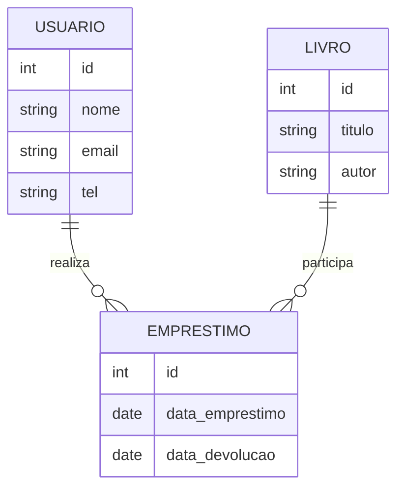

# Sistema de Biblioteca

## Modelo de dados

```mermaid
erDiagram
    USUARIO ||--o{ EMPRESTIMO : realiza
    LIVRO ||--o{ EMPRESTIMO : participa

    USUARIO {
        int id
        string nome
        string email
        string tel
    }

    LIVRO {
        int id
        string titulo
        string autor
    }

    EMPRESTIMO {
        int id
        date data_emprestimo
        date data_devolucao
    }
```
